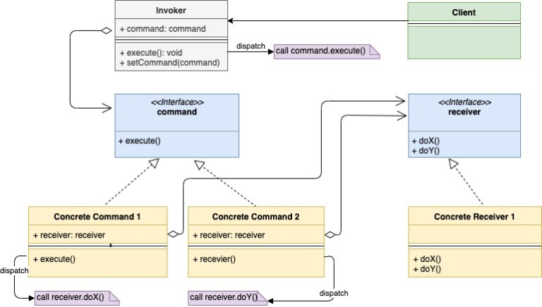

## 命令模式

命令模式是一种行为型模式。它建议将请求封装为一个独立的对象。在这个对象里包含请求相关的全部信息，因此可以将其独立执行。

在命令模式中有如下基础组件：

1. Receiver：唯一包含业务逻辑的类，命令对象会将请求传递给它，请求的最终处理者
1. Command：组装了一个`Receiver`成员，并绑定实现了`Receiver`的一个特定行为
1. Invoker：请求的发送者，组装了`Command`成员，通过调用`Command`实例的`execute()`方法来触发对应的指令
1. Client：通过将`Receiver`实例传递给`Command`构造器来创建`Command`对象，之后会将创建的对象同`Invoker`绑定。

还是通过一个具体的场景来理解下命令模式是怎样运行的。以打开电视这个行为举例，我们可以通过如下方式打开电视：

1. 通过遥控器开关打开电视
2. 通过电视上的开关打开电视

在这个场景中，我们有一个指令（Command）是“打开电视”，指令的接收者（Receiver）当然就是电视（TV）了，当我们执行（execute）指令时，相关指令就会让电视打开（TV.on()）。

再明确下这个场景中的所有组件：

- `Receiver`是`TV`
- `Command`只有一个，是打开电视：`ON`，这个指令需要组装`TV`成员
- `Invoker`是遥控打开或开关打开这两种方式，它们会组装`ON`指令成员。

注意，这里我们将“打开电视”这个请求封装到了一个`ON`指令对象中，这个指令可以被不同的调用方调用。在`ON`指令中嵌入了`TV`实例，可以被独立执行。

再举个例子，想想PhotoShop这个软件，在PhotoShop中，要执行“保存”操作有三种方式：

1. 从右键菜单中执行保存
2. 从工具栏菜单中执行保存
3. 使用Ctrl+S快捷键

这三种操作做的是同一件事情：保存正在编辑的图片。这三种操作的保存行为可以抽象为一个“Save”指令对象，而正在被编辑的图片就可以视为一个`Receiver`。

现在总结下使用命令对象的好处：

1. 抽象出了潜藏的真实业务逻辑，并将其和具体的操作解耦
2. 不需要为每个调用者创建不同的处理器
3. 指令对象包含了执行所需的全部信息，因此它也适用于需要延迟执行的场景

看下UML类图：



1. 注意下`Invoker`是怎样嵌入指令对象的。当一个请求发送给`Invoker`的时候，`Invoker`会将这个请求传递给其嵌入的命令对象。
2. 所有具体的指令类都会组装一个`Receiver`成员属性。

代码如下：

command.go（指令 interface）

```go
type command interface {
    execute()
}
```

device.go（Receiver interface）

```go
type device interface {
    on()
    off()
}
```

tv.go（Receiver）

```go
import "fmt"
 
type tv struct {
    isRunning bool
}
 
func (t *tv) on() {
    t.isRunning = true
    fmt.Println("Turning tv on")
}
 
func (t *tv) off() {
    t.isRunning = false
    fmt.Println("Turning tv off")
}
```

onCommand.go（指令）

```go
type onCommand struct {
    device device
}
 
func (c *onCommand) execute() {
    c.device.on()
}
```

offCommand.go（指令）

```go
type offCommand struct {
    device device
}
 
func (c *offCommand) execute() {
    c.device.off()
}

```

button.go（Invoker，开关打开电视）

```go
type button struct {
    command command
}
 
func (b *button) press() {
    b.command.execute()
}
```

main.go（Client）

```go
func main() {
 
    tv := &tv{}
    onCommand := &onCommand{
        device: tv,
    }
 
    offCommand := &offCommand{
        device: tv,
    }
 
    onButton := &button{
        command: onCommand,
    }
 
    onButton.press()
 
    offButton := &button{
        command: offCommand,
    }
    offButton.press()
}
```

运行结果：

```
Turning tv on
Turning tv off
```

