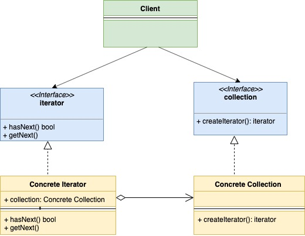

## 迭代器模式

迭代器模式是一种行为型模式。在这种模式中，集合结构会提供一个迭代器。通过这个迭代器可以顺序遍历集合中的每个元素而不需要暴露其具体的实现。

下面是迭代器模式的一些具体实现：

- Iterator 接口： 这个接口会定义一些基础的操作函数，如`hasNext()`或`getNext()`等。通过名称就可以看出，这些方法可以帮助我们执行遍历集合、重启迭代等操作。
- Collection 接口： 这个接口代表了要被遍历的集合。在这个接口里定义了一个`createIterator`方法，该方法会返回一个`Iterator`的实例。
- Concrete Iterator： `Iterator`接口的具体实现类。
- Concrete Collection： `Collection`接口的具体实现类。

在golang当前的版本（1.16或更早）中是没有泛型的，所以一些特殊情况下还是需要会用到迭代器模式。

来看下类图：



下面是示例代码：

iterator.go

```go
type iterator interface {
    hasNext() bool
    getNext() *user
}
```

collection.go

```go
type collection interface {
    createIterator() iterator
}
```

user.go：

```go
type user struct {
    name string
    age  int
}
```

userIterator.go：

```go
type userIterator struct {
    index int
    users []*user
}

func (u *userIterator) hasNext() bool {
    if u.index < len(u.users) {
        return true
    }
    return false
}

func (u *userIterator) getNext() *user {
    if u.hasNext() {
        user := u.users[u.index]
        u.index++
        return user
    }
    return nil
}
```

userCollection.go：

```go
type userCollection struct {
    users []*user
}

func (u *userCollection) createIterator() iterator {
    return &userIterator{
        users: u.users,
    }
}
```

main.go

```go
func main() {
    user1 := &user{
        name: "a",
        age:  30,
    }
    user2 := &user{
        name: "b",
        age:  20,
    }
    userCollection := &userCollection{
        users: []*user{user1, user2},
    }
    iterator := userCollection.createIterator()
    for iterator.hasNext() {
        user := iterator.getNext()
        fmt.Printf("User is %+v\n", user)
    }
}
```

输出内容：

```go
User is &{name:a age:30}
User is &{name:b age:20}
```

