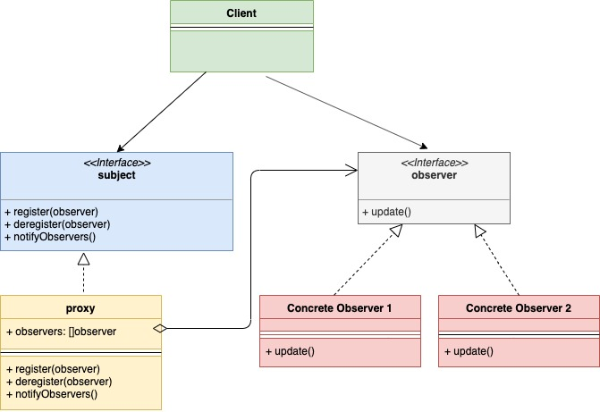

## 观察者模式

观察者模式是一种行为型设计模式。这种模式允许一个实例（可以称为目标对象）发布各种事件（event）给其他实例（观察者）。这些观察者会对目标对象进行订阅，这样每当目标对象发生变化时，观察者就会收到事件（event）通知。

来看个例子：在电商网站经常会有各种商品脱销，假如有顾客已经在关注这些商品，这些商品的脱销就会对他们产生不好的体验。如果顾客还想买这些商品，那么通常有如下解决方案：

1. 顾客以一定的频率检查这些商品是否在售
2. 电商平台将所有的上架的商品信息定期推送给用户
3. 顾客只订阅他所关注的特定商品的信息，当这些商品再次上架时他们会收到通知；多个顾客可以订阅同一个商品的信息

选项3是最为可行的一种方案。这也正是观察者模式所能做到的事情。观察者模式的核心组件为：

- Subject ： 目标对象，是有变化发生时就会发布相关事件的实例
- Observer ： 观察者，订阅目标对象的信息，会收到一些特定事件的通知

通常，Subject和Observer会被定义为接口，真正使用的是它们二者的具体实现。

UML类图如下：



下面是一个示例代码：

observer.go：

```go
type observer interface {
    update(string)
    getID() string
}
```

subject.go：

```go
type subject interface {
    register(Observer observer)
    deregister(Observer observer)
    notifyAll()
}
```

item.go：

```go
import "fmt"
 
type item struct {
    observerList []observer
    name         string
    inStock      bool
}
 
func newItem(name string) *item {
    return &item{
        name: name,
    }
}
 
func (i *item) updateAvailability() {
    fmt.Printf("Item %s is now in stock\n", i.name)
    i.inStock = true
    i.notifyAll()
}
 
func (i *item) register(o observer) {
    i.observerList = append(i.observerList, o)
}
 
func (i *item) deregister(o observer) {
    i.observerList = removeFromSlice(i.observerList, o)
}
 
func (i *item) notifyAll() {
    for _, observer := range i.observerList {
        observer.update(i.name)
    }
}
 
func removeFromSlice(observerList []observer, observerToRemove observer) []observer {
    observerListLength := len(observerList)
    for i, observer := range observerList {
        if observerToRemove.getID() == observer.getID() {
            observerList[observerListLength-1], observerList[i] = observerList[i], observerList[observerListLength-1]
            return observerList[:observerListLength-1]
        }
    }
    return observerList
}
```

customer.go：

```go
import "fmt"
 
type customer struct {
    id string
}
 
func (c *customer) update(itemName string) {
    fmt.Printf("Sending email to customer %s for item %s\n", c.id, itemName)
}
 
func (c *customer) getID() string {
    return c.id
}
```

在上面的代码中item是subject的实现，customer是observer实现。

看下场景类main.go：

```go
func main() {
    shirtItem := newItem("GoLang Design Patterns")
    observerFirst := &customer{id: "robin@zhyea.com"}
    observerSecond := &customer{id: "golang@zhyea.com"}
    shirtItem.register(observerFirst)
    shirtItem.register(observerSecond)
    shirtItem.updateAvailability()
}
```

执行后输出内容为：

```go
Item GoLang Design Patterns is now in stock
Sending email to customer robin@zhyea.com for item GoLang Design Patterns
Sending email to customer golang@zhyea.com for item GoLang Design Patterns
```

