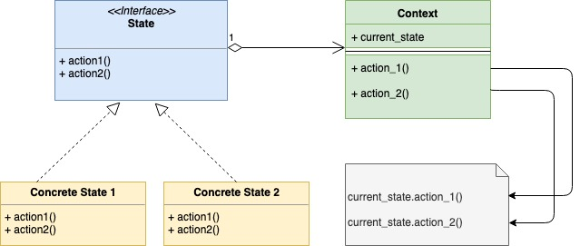

## 状态模式

状态模式，顾名思义，是一种基于有限状态机制的设计模式。在这种设计模式中，行为是由相应的状态来决定的。接下来我们会用一个售卖机的例子来说明下状态模式。为了便于说明，我们把场景简化一下，假设有一台售卖机只卖一种商品，且只有如下四种状态：

1. 有商品
2. 无商品
3. 商品请求中
4. 已收款

一台售卖机也应该会有多种功能，我们同样做一下简化，假设这台售卖机只有四个功能：

1. 选择商品
2. 补充商品
3. 投币
4. 吐出商品

### 什么时候使用状态模式

- 在一个对象有多种不同状态的时候。对象需要根据当前的请求来改变它的状态
  - 在前面提到的例子中，售卖机将会受到行为的影响从一种状态切换到另一种状态。比如，当“投币”行为结束后，售货机将会从“商品请求中”状态切换到“已收款”状态。
- 在一个对象需要根据它当前的状态对同一个请求做出不同响应的时候。这个时候使用状态模式可以避免大量的条件声明。
  - 仍然以售卖机为例，当用户想购买商品时，如果售卖机的状态为“有商品”，它就会继续处理，如果售卖机状态为“无商品”，它就会拒绝处理。请注意，这里售卖机根据它“有商品”和“无商品”的状态，对购买商品的请求作出了两种不同的响应。

### UML类图



### 代码

state.go：

```go
type state interface {
    addItem(int) error
    requestItem() error
    insertMoney(money int) error
    dispenseItem() error
}
```

在代码中我们定义了一个`state`接口，这个接口中有四个函数分别表示了售卖机的四种行为，如下：

1. 购买商品：addItem(int) error
2. 请求商品：requestItem() error
3. 投币：insertMoney(money int) error
4. 吐出商品：dispenseItem() error

每个具体的状态实现都实现了以上四个函数，并对每种行为发生时该切换到哪种状态，以及如何响应做了处理

每个具体的状态也都嵌入了一个指向当前售卖机的指针，这样以确保状态的切换是发生在这台售卖机上。

vendingMachine.go

```go
import "fmt"
 
type vendingMachine struct {
    hasItem       state
    itemRequested state
    hasMoney      state
    noItem        state
 
    currentState state
 
    itemCount int
    itemPrice int
}
 
func (v *vendingMachine) requestItem() error {
    return v.currentState.requestItem()
}
 
func (v *vendingMachine) addItem(count int) error {
    return v.currentState.addItem(count)
}
 
func (v *vendingMachine) insertMoney(money int) error {
    return v.currentState.insertMoney(money)
}
 
func (v *vendingMachine) dispenseItem() error {
    return v.currentState.dispenseItem()
}
 
func (v *vendingMachine) setState(s state) {
    v.currentState = s
}
 
func (v *vendingMachine) incrementItemCount(count int) {
    fmt.Printf("Adding %d items\n", count)
    v.itemCount = v.itemCount + count
}
```

注意这段代码，这里面没有任何条件表达式，所有逻辑处理均由相应的状态实现完成。

下面是具体的状态实现。

hasItemState.go

```go
import "fmt"
 
type hasItemState struct {
    vendingMachine *vendingMachine
}
 
func (i *hasItemState) requestItem() error {
    if i.vendingMachine.itemCount == 0 {
        i.vendingMachine.setState(i.vendingMachine.noItem)
        return fmt.Errorf("No item present")
    }
    fmt.Printf("Item requestd\n")
    i.vendingMachine.setState(i.vendingMachine.itemRequested)
    return nil
}
 
func (i *hasItemState) addItem(count int) error {
    fmt.Printf("%d items added\n", count)
    i.vendingMachine.incrementItemCount(count)
    return nil
}
 
func (i *hasItemState) insertMoney(money int) error {
    return fmt.Errorf("Please select item first")
}
func (i *hasItemState) dispenseItem() error {
    return fmt.Errorf("Please select item first")
}
```

hasMoneyState.go

```go
import "fmt"
 
type hasMoneyState struct {
    vendingMachine *vendingMachine
}
 
func (i *hasMoneyState) requestItem() error {
    return fmt.Errorf("Item dispense in progress")
}
 
func (i *hasMoneyState) addItem(count int) error {
    return fmt.Errorf("Item dispense in progress")
}
 
func (i *hasMoneyState) insertMoney(money int) error {
    return fmt.Errorf("Item out of stock")
}
 
func (i *hasMoneyState) dispenseItem() error {
    fmt.Println("Dispensing Item")
    i.vendingMachine.itemCount = i.vendingMachine.itemCount - 1
    if i.vendingMachine.itemCount == 0 {
        i.vendingMachine.setState(i.vendingMachine.noItem)
    } else {
        i.vendingMachine.setState(i.vendingMachine.hasItem)
    }
    return nil
}
```


itemRequestedState.go

```go
import "fmt"
 
type itemRequestedState struct {
    vendingMachine *vendingMachine
}
 
func (i *itemRequestedState) requestItem() error {
    return fmt.Errorf("Item already requested")
}
 
func (i *itemRequestedState) addItem(count int) error {
    return fmt.Errorf("Item Dispense in progress")
}
 
func (i *itemRequestedState) insertMoney(money int) error {
    if money < i.vendingMachine.itemPrice {
        fmt.Errorf("Inserted money is less. Please insert %d", i.vendingMachine.itemPrice)
    }
    fmt.Println("Money entered is ok")
    i.vendingMachine.setState(i.vendingMachine.hasMoney)
    return nil
}
 
func (i *itemRequestedState) dispenseItem() error {
    return fmt.Errorf("Please insert money first")
}
```

noItemState.go

```go
import "fmt"
 
type noItemState struct {
    vendingMachine *vendingMachine
}
 
func (i *noItemState) requestItem() error {
    return fmt.Errorf("Item out of stock")
}
 
func (i *noItemState) addItem(count int) error {
    i.vendingMachine.incrementItemCount(count)
    i.vendingMachine.setState(i.vendingMachine.hasItem)
    return nil
}
 
func (i *noItemState) insertMoney(money int) error {
    return fmt.Errorf("Item out of stock")
}
 
func (i *noItemState) dispenseItem() error {
    return fmt.Errorf("Item out of stock")
}
```

main.go

```go
import (
    "fmt"
    "log"
)
 
func main() {
    vendingMachine := newVendingMachine(1, 10)
    err := vendingMachine.requestItem()
    if err != nil {
        log.Fatalf(err.Error())
    }
    err = vendingMachine.insertMoney(10)
    if err != nil {
        log.Fatalf(err.Error())
    }
    err = vendingMachine.dispenseItem()
    if err != nil {
        log.Fatalf(err.Error())
    }
 
    fmt.Println()
    err = vendingMachine.addItem(2)
    if err != nil {
        log.Fatalf(err.Error())
    }
 
    fmt.Println()
 
    err = vendingMachine.requestItem()
    if err != nil {
        log.Fatalf(err.Error())
    }
 
    err = vendingMachine.insertMoney(10)
    if err != nil {
        log.Fatalf(err.Error())
    }
 
    err = vendingMachine.dispenseItem()
    if err != nil {
        log.Fatalf(err.Error())
    }
}
 
func newVendingMachine(itemCount, itemPrice int) *vendingMachine {
    v := &vendingMachine{
        itemCount: itemCount,
        itemPrice: itemPrice,
    }
    hasItemState := &hasItemState{
        vendingMachine: v,
    }
    itemRequestedState := &itemRequestedState{
        vendingMachine: v,
    }
    hasMoneyState := &hasMoneyState{
        vendingMachine: v,
    }
    noItemState := &noItemState{
        vendingMachine: v,
    }
 
    v.setState(hasItemState)
    v.hasItem = hasItemState
    v.itemRequested = itemRequestedState
    v.hasMoney = hasMoneyState
    v.noItem = noItemState
    return v
}
```

执行后输出为

```
Item requestd
Money entered is ok
Dispensing Item
 
Adding 2 items
 
Item requestd
Money entered is ok
Dispensing Item
```

