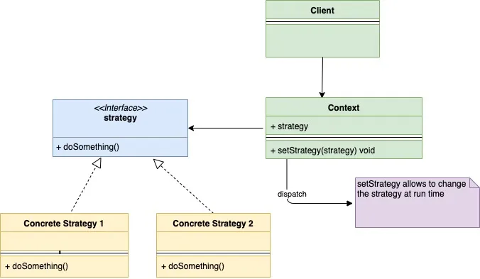
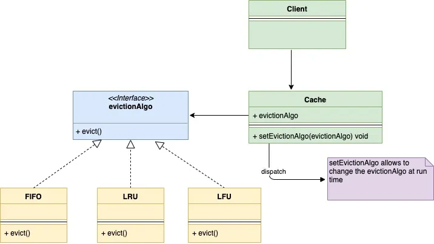

## 策略模式

策略模式是一种行为型设计模式。通过策略模式，可以在运行时修改一个对象的行为。

接下来仍然是通过例子来了解策略模式。比如说内存缓存，这是我们在开发中经常使用的东西，大家应该都有一定的了解，接下来就用内存缓存来说明下如何使用策略模式。

向内存里存东西对于GoLang来说算是比较简单的事情，通过`Map`就可以做到，不过还是建议创建一个`Cache` struct来稍稍封装一下。不过我们都知道，内存缓存占用的空间是有上限的。当快达到上限时，就需要清理一下缓存中已有的内容。如下是清理缓存的一些常见的算法：

- LRU（Least Recently Used）：清理最近使用的最少的那些缓存数据
- FIFO（First In First Out）：清理最早放入缓存的那些数据
- LFU（Least Frequently Used）：清理使用频率最低的那部分数据

现在的问题是如何将`Cache`和清理算法解耦，这样在运行时就可以调整清理缓存的算法了。但也要注意，在添加新的清理算法时，不应该改动`Cache`。这时候就需要用到策略模式了。策略模式建议为相同业务的各种算法创建一个算法组，然后将每种算法都封装起来，使之有相同的接口，并且不同算法之间可以互换。清理缓存的算法的接口就可以命名为：`evictionAlgo`。

然后将`evictionAlgo`接口嵌入`Cache`中就可以了。

不同于让`Cache`直接自己继承`evictionAlgo`接口，现在可以通过`evictionAlgo`接口来组装不同的清理算法。因为`evictionAlgo`是一个接口，这样在运行的时候就可以将之赋值为LRU、FIFO或LFU，而不需要对`Cache` struct做任何调整。

现在捋一下什么时候使用策略模式：

1. 当一个对象需要提供不同的行为，而又不想在运行时修改对象时
2. 当想在运行时选择不同的行为而又不想写大量的条件语句时
3. 当为同一种行为准备了不同的算法时

下面是策略模式的UML类图：



这里是我们当前这个内存缓存案例的UML图



具体代码如下：

evictionAlgo.go

```go
type evictionAlgo interface {
    evict(c *cache)
}
```

lru.go

```go
import "fmt"
 
type lru struct {
}
 
func (l *lru) evict(c *cache) {
    fmt.Println("Evicting by lru strategy")
}
```

fifo.go

```go
import "fmt"
 
type fifo struct {
}
 
func (l *fifo) evict(c *cache) {
    fmt.Println("Evicting by fifo strategy")
}
```

lfu.go

```go
import "fmt"
 
type lfu struct {
}
 
func (l *lfu) evict(c *cache) {
    fmt.Println("Evicting by lfu strategy")
}
```

cache.go

```go
type cache struct {
    storage      map[string]string
    evictionAlgo evictionAlgo
    capacity     int
    maxCapacity  int
}
 
func initCache(e evictionAlgo) *cache {
    storage := make(map[string]string)
    return &cache{
        storage:      storage,
        evictionAlgo: e,
        capacity:     0,
        maxCapacity:  2,
    }
}
 
func (c *cache) setEvictionAlgo(e evictionAlgo) {
    c.evictionAlgo = e
}
 
func (c *cache) add(key, value string) {
    if c.capacity == c.maxCapacity {
        c.evict()
    }
    c.capacity++
    c.storage[key] = value
}
 
func (c *cache) get(key string) {
    delete(c.storage, key)
}
 
func (c *cache) evict() {
    c.evictionAlgo.evict(c)
    c.capacity--
}
```

main.go

```go
func main() {
    lfu := &lfu{}
    cache := initCache(lfu)
    cache.add("a", "1")
    cache.add("b", "2")
    cache.add("c", "3")
    lru := &lru{}
    cache.setEvictionAlgo(lru)
    cache.add("d", "4")
    fifo := &fifo{}
    cache.setEvictionAlgo(fifo)
    cache.add("e", "5")
}
```

执行后的输出内容为：

```
Evicting by lfu strategy
Evicting by lru strategy
Evicting by fifo strategy
```

