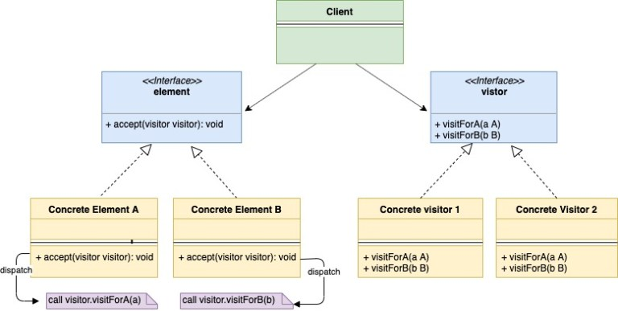
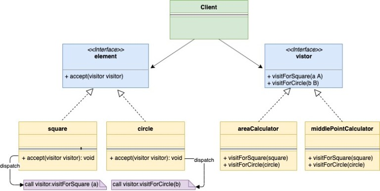

## 说明

访客模式是一种行为型设计模式。通过访客模式可以为struct添加方法而不需要对其做任何调整。

来看一个例子，假如我们需要维护一个对如下形状执行操作的库：

1. 方形（Square）
2. 圆形（Circle）
3. 长方形（Rectangle）

以上图形的struct都继承自一个共同的`shape`接口。公司内有多个团队都在使用这个库。假设现在有一个团队想要为这些图形struct添加一个获取面积的方法（`getArea()`）。有如下几种方法可以解决这种问题。

### 方法一

第一种方案就是直接在`shape`接口中添加`getArea()`方法。这样实现`shape`接口的每个struct都需要实现`getArea()`方法。这个方案看起来可行，但是却有一些问题：

1. 作为一个公用库的维护者，有时候不想为了添加一个额外的行为就调整已经做过严格测试的代码
2. 使用这个库的团队可能会提出添加更多行为的请求，比如`getNumSides()`、`getMiddleCoordinates()`。面对这种情况，我们通常都不想持续修改这个库，而是希望这些团队继承我们这个库，自己实现自己的需求。

### 方法二

第二个方案就是由提出需求的团队自己实现相关的行为逻辑。要获取`shape`的面积就可以根据struct的类型作如下的实现：

```go
if shape.type == square {
   //Calculate area for squre
} elseif shape.type == circle {
    //Calculate area of triangle
} elseif shape.type == "triangle" {
    //Calculate area of triangle
} else {
   //Raise error
}
```

以上的代码仍然是有问题的：这种方案不能充分利用接口的特性，反而还需要添加额外的类型来检查代码，造成整体结构的脆弱。此外，在运行时获取对象的类型可能会存在一些性能问题，在一些语言中甚至还不能获取对象的类型。

### 方法三

第三种方案就是使用访客模式来解决这个问题。我们可以定义一个如下的访客接口：

```go
type visitor interface {
   visitForSquare(square)
   visitForCircle(circle)
   visitForTriangle(triangle)
}
```

接口中的三个函数`visitforSquare(square)`、`visitForTriangle(triangle)`、`visitForCircle(circle)`允许我们分别为`Square`、`Circle`和`Triangle`三个struct分别添加函数。

现在可以开始考虑一个问题了：为什么我们不在`visitor`接口中添加一个`visit(shape)`方法，而是为每种形状单独写了一个visit方法？原因很简单：Go语言不支持。

接下来在`shape`接口中添加一个`accept`方法：

```go
func accept(v visitor)
```

每一个实现`shape`的struct都需要定义这个方法。额，等等，我们刚才好像提到过不想修改现有的`shape` struct。但是要使用访客模式就不得不修改相关的`shape` struct，不过这些修改只需要做一次。假如我们还希望添加注入`getNumSides()`（获取边数）、`getMiddleCoordinates()`（获取中心坐标），此时就不需要再对相关的struct做任何调整了，可以直接使用前面定义的`accept(v visitor)`方法了。

基本上就是这样了，只需修改实现`shape`接口的struct一次，之后想再添加多少个额外的行为都可以使用同一个`accept()`方法。接下来看下具体是怎么做的。

让struct `square`实现一个`accept()`方法：

```go
func (obj *squre) accept(v visitor){
    v.visitForSquare(obj)
}
```

同样，`circle`和`triangle`也需要实现`accept()`方法。

现在想要添加`getArea()`方法的团队就可以实现`visitor`接口并在相关的方法中自行添加计算面积的逻辑：

如areaCalculator.go：

```go
type areaCalculator struct{
    area int
}
 
func (a *areaCalculator) visitForSquare(s *square){
    //Calculate are for square
}
func (a *areaCalculator) visitForCircle(s *square){
    //Calculate are for circle
}
func (a *areaCalculator) visitForTriangle(s *square){
    //Calculate are for triangle
}
```

比如要计算正方形的面积，我们先创建一个`square`实例，然后进行如下简单的调用就可以了：

```go
sq := &square{}
ac := &areaCalculator{}
sq.accept(ac)
```

同理，另一个想要获取形状中心坐标的团队也可以像前面那样自己实现`visitor`接口并添加相关的方法：

middleCoordinates.go：

```go
type middleCoordinates struct {
    x int
    y int
}
 
func (a *middleCoordinates) visitForSquare(s *square) {
    //Calculate middle point coordinates for square. After calculating the area assign in to the x and y instance variable.
}
 
func (a *middleCoordinates) visitForCircle(c *circle) {
    //Calculate middle point coordinates for square. After calculating the area assign in to the x and y instance variable.
}
 
func (a *middleCoordinates) visitForTriangle(t *triangle) {
    //Calculate middle point coordinates for square. After calculating the area assign in to the x and y instance variable.
}
```

## UML类图

通过前面的说明，我们可以总结出访客模式的类图：



如下是前面的例子的类图：



## 代码说明

shape.go

```go
type shape interface {
    getType() string
    accept(visitor)
}
```

square.go

```go
type square struct {
    side int
}
 
func (s *square) accept(v visitor) {
    v.visitForSquare(s)
}
 
func (s *square) getType() string {
    return "Square"
}
```

circle.go:

```go
type circle struct {
    radius int
}
 
func (c *circle) accept(v visitor) {
    v.visitForCircle(c)
}
 
func (c *circle) getType() string {
    return "Circle"
}
```

rectangle.go:

```go
type rectangle struct {
    l int
    b int
}
 
func (t *rectangle) accept(v visitor) {
    v.visitForRectangle(t)
}
 
func (t *rectangle) getType() string {
    return "rectangle"
}
```

visitor.go:

```go
type visitor interface {    
    visitForSquare(*square)
    visitForCircle(*circle)
    visitForRectangle(*rectangle)
}
```

areaCalculator.go:

```go
type areaCalculator struct {
    area int
}
 
func (a *areaCalculator) visitForSquare(s *square) {
    //Calculate area for square. After calculating the area assign in to the area instance variable
    fmt.Println("Calculating area for square")
}
 
func (a *areaCalculator) visitForCircle(s *circle) {
    //Calculate are for circle. After calculating the area assign in to the area instance variable
    fmt.Println("Calculating area for circle")
}
 
func (a *areaCalculator) visitForRectangle(s *rectangle) {
    //Calculate are for rectangle. After calculating the area assign in to the area instance variable
    fmt.Println("Calculating area for rectangle")
}
```

middleCoordinates.go:

```go
type middleCoordinates struct {
    x int
    y int
}
 
func (a *middleCoordinates) visitForSquare(s *square) {
    //Calculate middle point coordinates for square. After calculating the area assign in to the x and y instance variable.
    fmt.Println("Calculating middle point coordinates for square")
}
 
func (a *middleCoordinates) visitForCircle(c *circle) {
    //Calculate middle point coordinates for square. After calculating the area assign in to the x and y instance variable.
    fmt.Println("Calculating middle point coordinates for circle")
}
 
func (a *middleCoordinates) visitForRectangle(t *rectangle) {
    //Calculate middle point coordinates for square. After calculating the area assign in to the x and y instance variable.
    fmt.Println("Calculating middle point coordinates for rectangle")
}
```

main.go：

```go
func main() {
    square := &square{side: 2}
    circle := &circle{radius: 3}
    rectangle := &rectangle{l: 2, b: 3}
 
    areaCalculator := &areaCalculator{}
    square.accept(areaCalculator)
    circle.accept(areaCalculator)
    rectangle.accept(areaCalculator)
 
    fmt.Println()
    middleCoordinates := &middleCoordinates{}
    square.accept(middleCoordinates)
    circle.accept(middleCoordinates)
    rectangle.accept(middleCoordinates)
}
```

输出内容为：

```
Calculating area for square
Calculating area for circle
Calculating area for rectangle
 
Calculating middle point coordinates for square
Calculating middle point coordinates for circle
Calculating middle point coordinates for rectangle
```

