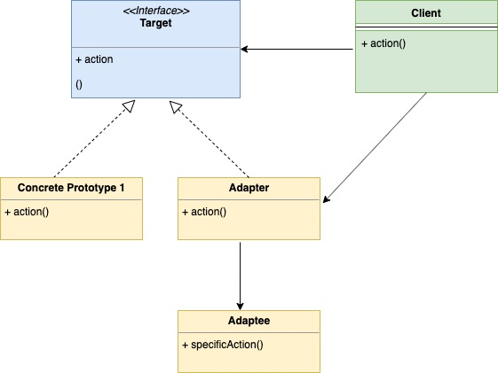
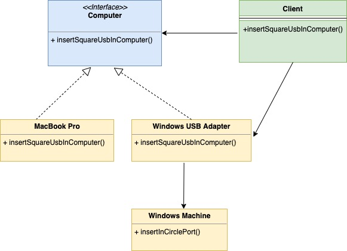

## 适配器模式

### 说明

适配器模式是一种结构型设计模式。我们用常用的两种笔记本电脑来说明一下这种设计模式。

我们常用的笔记本无非是这两大类：

1. Macbook Pro
2. Windows Laptop

当前这两类笔记本常见的一个区别大概是USB接口的类型了：

1. Macbook Pro的USB接口现在多为扁圆形的Type-C接口
2. Windows笔记本的USB接口则多为方形的Type-A接口

现在我手上有一个Type-C扁圆口的U盘，但是我用的笔记本Windows，这该怎么办呢？

这也是编程时常遇到的一种问题：

我们有一个已经封装严谨的类（如Windows笔记本），它提供了一些功能并指定对接参数的类型（如Type-A方形USB接口）。但是现在有一个不同类型的实例（Type-C扁圆形口U盘），也想用这个已经封装好的类提供的功能。此时该怎么做？

这时就可以应用适配器模式了。我们创建一个`Adapter`类，他可以提供如下功能：

- 按照已有类指定的参数类型进行实现
- 转译调用方的请求

在我们前面的例子中，这个`Adapter`就可以是一个转接器，它接收Type-C扁圆形接口的输入，提供Type-A方形接口的数据输出，从而能让我们顺利地使用上手头的方口U盘。

### UML类图

看下类图：



然后是前面举的例子的类图：



### 代码

示例代码如下：

computer.go

```go
type computer interface {
    insertInSquarePort()
}
```

mac.go

```go
type mac struct {
}
 
func (m *mac) insertInSquarePort() {
    fmt.Println("Insert square port into mac machine")
}
```

windows.go

```go
type windows struct{}
 
func (w *windows) insertInCirclePort() {
    fmt.Println("Insert circle port into windows machine")
}
```

windowsAdapter.go

```go
type windowsAdapter struct {
    windowMachine *windows
}

func (w *windowsAdapter) insertInSquarePort() {
    w.windowMachine.insertInCirclePort()
}
```

输出内容：

```
Insert square port into mac machine
Insert circle port into windows machine
```

