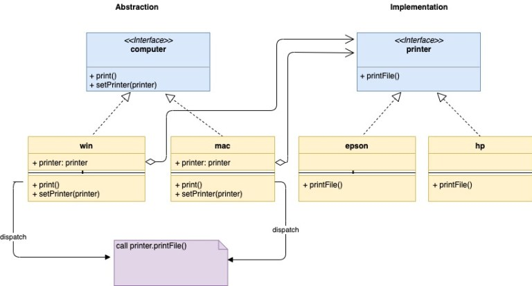

## 桥接模式

桥接模式是一种结构型设计模式，通过桥接模式可以将抽象部分和它的实现部分分离。这看着有点儿奇怪，接下来会作详细说明。

桥接模式建议将一个较大的类拆分成两中角色。

- 抽象角色 - 抽象角色是一个接口。它的子类也被称为修正抽象角色。抽象角色包含一个对实现角色的引用。
- 实现角色 - 实现角色也是一个接口。实现角色的子类被称为具化实现角色。

这样分层的优势在于在调用抽象角色的时候不需要考虑实现层的内容。

举个例子，假设我们手上有两部笔记本：Mac本和Windows本；同时也有两部打印机：爱普生（Epson）打印机和惠普（Hp）打印机。我们希望笔记本和打印机能任意组合来完成工作，用户只通过笔记本进行操作而无需关心打印机是如何工作的。

这个例子中有2×2四种组合，但是不需要为此创建四个struct，而是创建两层：

- 抽象层
- 实现层

看下下面的图。在图中可以看到抽象层（这里是computer）和实现层（这里是printer）通过抽象层中对实现层的引用来进行交互，这个引用就是桥接模式所谓的桥梁。通过桥接模式，抽象层和引用层可以分别独立实现而不互相影响。



注意图中win和mac是如何嵌入printer的引用的：这里绑定的是printer接口，而非是priter的具体实现。这样就可以在运行时修改printer的值。如前面所说，printer引用在这里扮演了一个桥梁的角色，并实现了computer和printer的松耦合。

桥接模式的UML图如下：


接下来是前面的例子的代码。

抽象角色，computer.go：

```go
type computer interface {
    print()
    setPrinter(printer)
}
```


修正抽象角色1，win.go

```go
import "fmt"
 
type windows struct {
    printer printer
}
 
func (w *windows) print() {
    fmt.Println("Print request for windows")
    w.printer.printFile()
}
 
func (w *windows) setPrinter(p printer) {
    w.printer = p
}
```


修正抽象角色2，mac.go

```go
import "fmt"
 
type mac struct {
    printer printer
}
 
func (m *mac) print() {
    fmt.Println("Print request for mac")
    m.printer.printFile()
}
 
func (m *mac) setPrinter(p printer) {
    m.printer = p
}
```


实现角色，printer.go

```go
type printer interface {
    printFile()
}
```


具体实现角色1，epson.go

```go
import "fmt"
 
type epson struct {
}
 
func (p *epson) printFile() {
    fmt.Println("Printing by a EPSON Printer")
}
```


具体实现角色2，hp.go

```go
type hp struct {
}
 
func (p *hp) printFile() {
    fmt.Println("Printing by a HP Printer")
}
```


Client， main.go

```go
func main() {
    hpPrinter := &hp{}
    epsonPrinter := &epson{}
    macComputer := &mac{}
    macComputer.setPrinter(hpPrinter)
    macComputer.print()
    fmt.Println()
    macComputer.setPrinter(epsonPrinter)
    macComputer.print()
    fmt.Println()
    winComputer := &windows{}
    winComputer.setPrinter(hpPrinter)
    winComputer.print()
    fmt.Println()
    winComputer.setPrinter(epsonPrinter)
    winComputer.print()
    fmt.Println()
}
```


输出内容：

```
Print request for mac
Printing by a HP Printer
 
Print request for mac
Printing by a EPSON Printer
 
Print request for windows
Printing by a HP Printer
 
Print request for windows
Printing by a EPSON Printer
```

