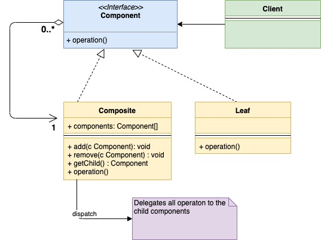

## 定义

组合模式是一种结构型设计模式。

当我们想把一组对象当做一个整体来处理时就可以考虑使用组合模式。

组合模式被视为是接口型设计模式是因为它将一组对象组装为一个树状结构。这个树状结构中的每个独立组件都可以用同样的方式来处理——无论它们是复杂的还是原始的。

以计算机操作系统中的文件系统为例。在文件系统中有文件（File）和文件夹（Folder）两类对象，在常见的各种使用场景中，它们的处理方式都差不多是一样的。接下来我们会依据文件系统对组合模式做更详细的阐释。

## 什么时候使用

一、当从调用方的角度看来，组装体和独立组件需要以同样的方式来处理时可以使用组合模式

在文件系统中这个例子中，假设我们需要通过关键字来搜索文件。这个搜索操作通常会对文件和文件夹同时进行：

- 对于一个文件来说，会从文件的内容中进行关键字检索
- 对于一个文件夹来说，会使用关键字递归遍历检索文件夹中的每个文件

二、当组装体和独立组件可以组成一个树状结构时可以使用组合模式

文件系统中的文件夹和文件显然是可以组成树状结构的。

## UML Diagram

类图如下：



介绍下类图中的各个组成部分：

- 组件（Component）：一个接口，定义了组装体和叶子对象的共同操作
- 组装体（Composite）：`Component`接口的实现，包含了一组子组件
- 叶子（Leaf）：树结构中最基础的对象，也实现了`Component`接口

## 代码

Component interface component.go

```go
type component interface {
    search(string)
}
```

Composite folder.go

```go
type folder struct {
    components []component
    name       string
}
 
func (f *folder) search(keyword string) {
    fmt.Printf("Serching recursively for keyword %s in folder %s\n", keyword, f.name)
    for _, composite := range f.components {
        composite.search(keyword)
    }
}
 
func (f *folder) add(c component) {
    f.components = append(f.components, c)
}
```

Leaf file.go

```go
type file struct {
    name string
}
 
func (f *file) search(keyword string) {
    fmt.Printf("Searching for keyword %s in file %s\n", keyword, f.name)
}
 
func (f *file) getName() string {
    return f.name
}
```

client main.go

```go
func main() {
    file1 := &file{name: "File1"}
    file2 := &file{name: "File2"}
    file3 := &file{name: "File3"}
    folder1 := &folder{
        name: "Folder1",
    }
    folder1.add(file1)
    folder2 := &folder{
        name: "Folder2",
    }
    folder2.add(file2)
    folder2.add(file3)
    folder2.add(folder1)
    folder2.search("rose")
}
```

