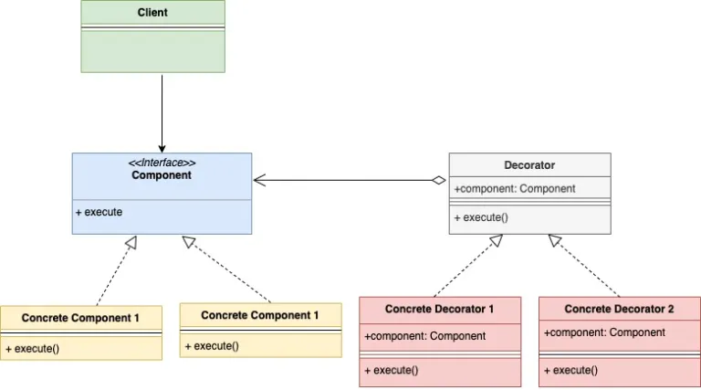

## 装饰模式

装饰器模式是一种结构型设计模式。通过装饰器模式可以为一个对象添加额外的功能而不需对其作出调整。

还是通过具体的案例来了解装饰器模式：假设我们开了一家披萨店，现在店里主营两款披萨：

- 素食狂披萨（Veggie Mania Pizza）
- 活力豆腐披萨（Peppy Tofu pizza）

以上两款披萨有不同的价格，为获取价格需要定义这样一个接口：

```go
type pizza interface {
    getPrice() int
}
```

然后需要这两款披萨分别创建一个struct并实现`getPrice()`函数来返回价格。因为定义了`getPrice()`函数，因此这两款披萨的struct可以视为实现了`pizza`接口。

现在又有了一些变化：我们为设计了一些特色配料，这些配料也是需要收费的。这样我们需要修改下之前的`pizza`接口，通过装饰器的形式将配料（`topping`）的信息给加进去。当前已有的配料为：

- 番茄酱（TomatoTopping）
- 奶酪（CheeseTopping）

另外，我们也得注意，加了配料的披萨也是一种新的披萨，所以现在顾客有了更多的选择：

- 素食狂披萨 + 番茄酱
- 素食狂披萨 + 奶酪
- 不加任何配料的素食狂披萨
- 活力豆腐披萨 + 番茄酱
- ...

加上配料的信息后情况变得复杂起来了，为每种选择都创建一个新的struct明显是不可行的。装饰器模式是一个不错的解决方案：使用装饰器模式可以在不修改已有的struct的前提下添加额外的功能。要使用装饰器模式，我们需要为每种配料（Topping）分别创建一个struct。配料的struct也需要继承前面的`pizza`接口并嵌入一个`pizza`接口的实例。

现在每种披萨以及每种配料都有一个独立的struct了。每种披萨和配料都有各自的价格。当为披萨添加配料的时候，只需要在披萨的价格的基础上加上配料的价格就可以计算出最终的价格。

现在可以看到装饰器模式的作用了：我们不需要对`pizza` struct做任何调整，只是在`pizza`对象的基础上做了一些装饰就得到了最终的价格。在这个过程中`pizza` struct不知道 `topping` struct的任何信息，只知道自己的价格。

下面是装饰器模型的UML类图：



类图中ConcreteComponent（VeggieMania和PeppyTofu）和ConcreteDecorator（Topping）都实现了Component接口（Pizza），并且ConcreteDecorator还嵌入了一个Component接口的一个实例。

对比我们前面的例子：

- `pizza`接口是图中的Component
- `veggieMania`和`peppyPanner`是图中的ConcreteComponent，他们都实现了`pizza`接口
- ConcreteDecorator的代表是`cheeseTopping`和`tomatoTopping`，它们也都实现了`pizza`接口，同时它们也都嵌入了一个`pizza`接口的实例

来看看具体的代码吧：

pizza.go

```go
type pizza interface {
    getPrice() int
}
```

peppyTofu.go

```go
type peppyTofu struct {
}
 
func (p *peppyTofu) getPrice() int {
    return 20
}
```

veggeMania.go

```go
type veggieMania struct {
}
 
func (p *veggieMania) getPrice() int {
    return 15
}
```

cheeseTopping.go

```go
type cheeseTopping struct {
    pizza pizza
}
 
func (c *cheeseTopping) getPrice() int {
    pizzaPrice := c.pizza.getPrice()
    return pizzaPrice + 10
}
```

tomatoTopping.go

```go
type tomatoTopping struct {
    pizza pizza
}
 
func (c *tomatoTopping) getPrice() int {
    pizzaPrice := c.pizza.getPrice()
    return pizzaPrice + 7
}
```

main.go

```go
func main() {
 
    veggiePizza := &veggieMania{}
 
    //Add cheese topping
    veggiePizzaWithCheese := &cheeseTopping{
        pizza: veggiePizza,
    }
 
    //Add tomato topping
    veggiePizzaWithCheeseAndTomato := &tomatoTopping{
        pizza: veggiePizzaWithCheese,
    }
 
    fmt.Printf("Price of veggieMania pizza with tomato and cheese topping is %d\n", veggiePizzaWithCheeseAndTomato.getPrice())
 
    peppyTofuPizza := &peppyTofu{}
 
    //Add cheese topping
    peppyTofuPizzaWithCheese := &cheeseTopping{
        pizza: peppyTofuPizza,
    }
 
    fmt.Printf("Price of peppyTofu with tomato and cheese topping is %d\n", peppyTofuPizzaWithCheese.getPrice())
 
}
```

输出内容：

```
Price of veggieMania pizza with tomato and cheese topping is 32
Price of peppyTofu with tomato and cheese topping is 30
```

