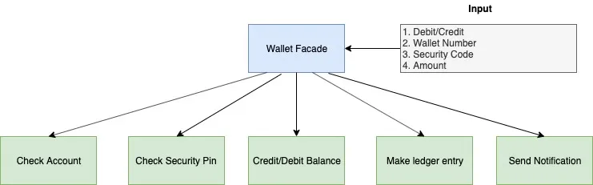
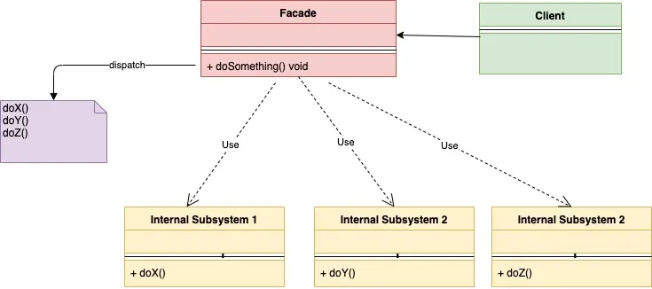
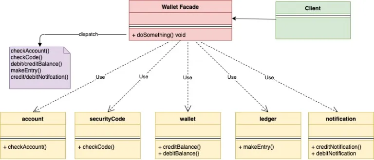

## 门面模式

门面模式是一种结构型设计模式。这种模式的作用是隐藏系统底层的复杂逻辑，只提供一个简单易用的接口给调用者。通过门面模式，将系统底层所需要的各种接口整理为一个通用的接口以便于调用方使用。换句话说，就是门面模式为一个复杂系统做了更高层次的抽象。

> 指商店房屋及沿街的部分，指店铺外表

以上来自百度百科。

正如这个词的表面意义：对于一个建筑，一般的路人只能看到它的外表，而不会知道这个建筑内里的复杂结构。

下面通过一个简单的例子来了解门面模式：在移动互联网时代，人们在付款时通常都会选在在线支付的方式。就在在线的这样一个简单操作中，支付系统底层做了许多的动作。但是不管是付款方还是收款方对此都没有感知。

下面是收付款过程中，电子支付系统需要做的几件事情：

- 账户检查（Check Account）
- 安全校验（Check Security Pin）
- 收支检验（Credit/Debit Balance）
- 账目记录（Make Ledger Entry）
- 发送提醒（Send Notification）

正如上面所列出的，在一个简单付款操作背后隐藏了许多操作。这就是门面模式可以发挥作用的地方。作为一个使用者，只需要输入账户、密码、金额等几项基础信息，其它的操作都可以交给系统在后台自动完成。



综上所述，我们可以知道门面模式的使用场景：当我们想为一个复杂系统提供简单调用方式的时候就可以使用门面模式。

门面模式的UML类图如下：



下面是在线支付这个案例对应的UML类图：



看下在线支付这个例子的代码实现：

walletFacade.go

```go
type walletFacade struct {
    account      *account
    wallet       *wallet
    securityCode *securityCode
    notification *notification
    ledger       *ledger
}
 
func newWalletFacade(accountID string, code int) *walletFacade {
    fmt.Println("Starting create account")
    walletFacade := &walletFacade{
        account:      newAccount(accountID),
        securityCode: newSecurityCode(code),
        wallet:       newWallet(),
        notification: &notification{},
        ledger:       &ledger{},
    }
    fmt.Println("Account created")
    return walletFacade
}
 
func (w *walletFacade) addMoneyToWallet(accountID string, securityCode int, amount int) error {
    fmt.Println("Starting add money to wallet")
    err := w.account.checkAccount(accountID)
    if err != nil {
        return err
    }
    err = w.securityCode.checkCode(securityCode)
    if err != nil {
        return err
    }
    w.wallet.creditBalance(amount)
    w.notification.sendWalletCreditNotification()
    w.ledger.makeEntry(accountID, "credit", amount)
    return nil
}
 
func (w *walletFacade) deductMoneyFromWallet(accountID string, securityCode int, amount int) error {
    fmt.Println("Starting debit money from wallet")
    err := w.account.checkAccount(accountID)
    if err != nil {
        return err
    }
    err = w.securityCode.checkCode(securityCode)
    if err != nil {
        return err
    }
    err = w.wallet.debitBalance(amount)
    if err != nil {
        return err
    }
    w.notification.sendWalletDebitNotification()
    w.ledger.makeEntry(accountID, "credit", amount)
    return nil
}
```

account.go

```go
type account struct {
    name string
}
 
func newAccount(accountName string) *account {
    return &account{
        name: accountName,
    }
}
 
func (a *account) checkAccount(accountName string) error {
    if a.name != accountName {
        return fmt.Errorf("Account Name is incorrect")
    }
    fmt.Println("Account Verified")
    return nil
}
```

securityCode.go

```go
type securityCode struct {
    code int
}
 
func newSecurityCode(code int) *securityCode {
    return &securityCode{
        code: code,
    }
}
 
func (s *securityCode) checkCode(incomingCode int) error {
    if s.code != incomingCode {
        return fmt.Errorf("Security Code is incorrect")
    }
    fmt.Println("SecurityCode Verified")
    return nil
}
```

wallet.go

```go
type wallet struct {
    balance int
}
 
func newWallet() *wallet {
    return &wallet{
        balance: 0,
    }
}
 
func (w *wallet) creditBalance(amount int) {
    w.balance += amount
    fmt.Println("Wallet balance added successfully")
    return
}
 
func (w *wallet) debitBalance(amount int) error {
    if w.balance < amount {
        return fmt.Errorf("Balance is not sufficient")
    }
    fmt.Println("Wallet balance is Sufficient")
    w.balance = w.balance - amount
    return nil
}
```

ledger.go

```go
type ledger struct {
}
 
func (s *ledger) makeEntry(accountID, txnType string, amount int) {
    fmt.Printf("Make ledger entry for accountId %s with txnType %s for amount %d", accountID, txnType, amount)
    return
}
```

notification.go

```go
type notification struct {
}
 
func (n *notification) sendWalletCreditNotification() {
    fmt.Println("Sending wallet credit notification")
}
 
func (n *notification) sendWalletDebitNotification() {
    fmt.Println("Sending wallet debit notification")
}
```

main.go

```go
func main() {
    fmt.Println()
    walletFacade := newWalletFacade("abc", 1234)
    fmt.Println()
    err := walletFacade.addMoneyToWallet("abc", 1234, 10)
    if err != nil {
        log.Fatalf("Error: %s\n", err.Error())
    }
    fmt.Println()
    err = walletFacade.deductMoneyFromWallet("ab", 1234, 5)
    if err != nil {
        log.Fatalf("Error: %s\n", err.Error())
    }
}
```

输出内容

```go
Starting create account
Account created
 
Starting add money to wallet
Account Verified
SecurityCode Verified
Wallet balance added successfully
Sending wallet credit notification
Make ledger entry for accountId abc with txnType credit for amount 10
Starting debit money from wallet
2022/03/13 21:29:00 Error: Account Name is incorrect
```

