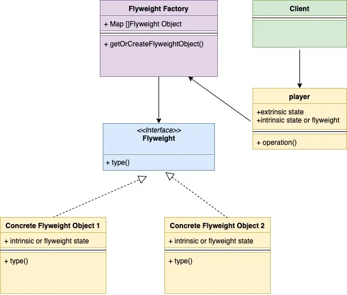
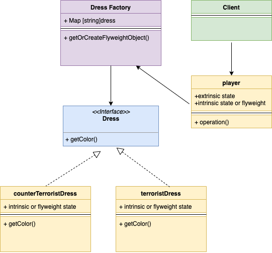

## 享元模式

享元模式是一种结构型设计模式。当我们需要为一个类创建大量相同的对象时就可能会需要用到这种设计模式。这些对象被称为享元对象并且是不可变的。

我们先来看一个例子。看完这个例子后我想应该就可以对享元模式有一定了解了。

在《反恐精英》这个游戏中，恐怖分子（Terrorist）和反恐精英（Counter-Terrorist）有不同的皮肤。简单起见，我们假设恐怖分子和反恐精英都只有一种皮肤（`dress`）类型，皮肤（`dress`）类型的对象会嵌在玩家（`player`）类型的对象中。

下面是玩家（player）类型的struct，可以看到`dress`的对象嵌在`player` struct中：

```go
type player struct {
    dress      dress
    playerType string //Can be T or CT
    lat        int
    long       int
}
```

假设现在有5个恐怖分子和5个反恐精英，也就是说共有10个玩家。对于如何处理这10个玩家的皮肤现在有两种处理方案：

1. 为每10个玩家对象分别创建一个皮肤对象并做嵌入，这样需要创建10个皮肤对象；
2. 只创建两个皮肤对象：
   - 一个恐怖分子皮肤对象：这个皮肤对象由5个恐怖分子对象共享
   - 一个反恐精英皮肤对象：同样由5个反恐精英对象共享

可以看到，在方案一中共需要创建10个皮肤对象，而在方案二中只需要创建两个皮肤对象。第二种方案也是享元模式所使用的方案。在这个方案中的两个皮肤对象被称为享元对象。这两个享元对象可以在多个对象间共享。这样不只是减少了需要创建的皮肤对象的数量，更大的好处在于即使我们创建了更多的玩家对象，这两个对象也是够用的。

在享元模式中，我们将享元对象保存在一个map中。这样每当需要一个享元对象时就可以直接从map中获取。

现在总结下享元模式的使用时机：

1. 当对象有一些可以共享的内部属性
   - 在上面的例子中，皮肤就是被拿出来共享的内部属性
2. 当需要创建大量对象以至于可能会引起内存问题时

看下享元模式的UML类图：



下面是上面的例子的类图：



接下来是上面的例子的代码：

dress.go

```go
type dress interface {
    getColor() string
}
```

terroristDress.go

```go
type terroristDress struct {
    color string
}
 
func (t *terroristDress) getColor() string {
    return t.color
}
 
func newTerroristDress() *terroristDress {
    return &terroristDress{color: "red"}
}
```

counterTerroristDress.go

```go
type counterTerroristDress struct {
    color string
}
 
func (c *counterTerroristDress) getColor() string {
    return c.color
}
 
func newCounterTerroristDress() *counterTerroristDress {
    return &counterTerroristDress{color: "green"}
}
```

dressFactory.go

```go
const (
    //TerroristDressType terrorist dress type
    TerroristDressType = "tDress"
    //CounterTerroristDressType terrorist dress type
    CounterTerroristDressType = "ctDress"
)
 
var (
    dressFactorySingleInstance = &dressFactory{
        dressMap: make(map[string]dress),
    }
)
 
type dressFactory struct {
    dressMap map[string]dress
}
 
func (d *dressFactory) getDressByType(dressType string) (dress, error) {
    if d.dressMap[dressType] != nil {
        return d.dressMap[dressType], nil
    }
    if dressType == TerroristDressType {
        d.dressMap[dressType] = newTerroristDress()
        return d.dressMap[dressType], nil
    }
    if dressType == CounterTerroristDressType {
        d.dressMap[dressType] = newCounterTerroristDress()
        return d.dressMap[dressType], nil
    }
    return nil, fmt.Errorf("Wrong dress type passed")
}
 
func getDressFactorySingleInstance() *dressFactory {
    return dressFactorySingleInstance
}
```

player.go

```go
type player struct {
    dress      dress
    playerType string
    lat        int
    long       int
}
 
func newPlayer(playerType, dressType string) *player {
    dress, _ := getDressFactorySingleInstance().getDressByType(dressType)
    return &player{
        playerType: playerType,
        dress:      dress,
    }
}
 
func (p *player) newLocation(lat, long int) {
    p.lat = lat
    p.long = long
}
```

main.go

```go
func main() {
    game := newGame()
    //Add Terrorist
    game.addTerrorist(TerroristDressType)
    game.addTerrorist(TerroristDressType)
    game.addTerrorist(TerroristDressType)
    game.addTerrorist(TerroristDressType)
    //Add CounterTerrorist
    game.addCounterTerrorist(CounterTerroristDressType)
    game.addCounterTerrorist(CounterTerroristDressType)
    game.addCounterTerrorist(CounterTerroristDressType)
 
    dressFactoryInstance := getDressFactorySingleInstance()
    for dressType, dress := range dressFactoryInstance.dressMap {
        fmt.Printf("DressColorType: %s\nDressColor: %s\n", dressType, dress.getColor())
    }
}
```

