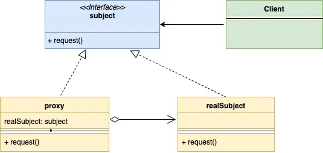
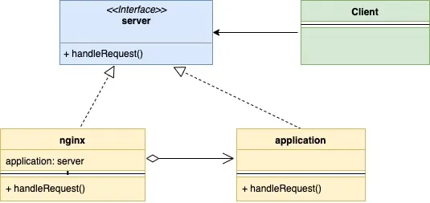

## 代理模式

代理模式是一种结构型设计模式。这种模式建议在访问对象时，添加一个额外的控制层，以便更灵活智能得对访问进行管理。

在这种模式中，会实现主对象的接口创建一个新的代理类。这让我们在执行主对象的逻辑前可以做一些额外的行为。看两个例子吧：

1. 信用卡可以视为是银行账户的代理。它的操作逻辑和银行账户相同，但却更容易使用。
2. 诸如Nginx这样的web服务器可以视为是应用服务器的代理，它可以起到如下的作用：
   * 控制对应用服务器的访问，比如执行限流
   * 做一些额外的动作，比如做一些缓存

看下代理模式的UML类图：



简单介绍下类图中的成员：

* `Subject`: 代表了主对象类（`realSubject`）和代理类（`proxy`）都需要实现的接口
* `Proxy`: 代表了代理类，在代理类中会嵌入`realSubject`实例，在它自己做完对请求的处理后，会将请求传递给`realSubject`实例进行操作
* `RealSubject`: 主对象类，包含了真实的业务逻辑，在代理模式中被置于代理类之后
* `Client`: 场景类，和代理类及主对象类都进行交互，因为二者实现了相同的接口

下面是前面介绍的nginx和应用服务器的例子所对应的类图：



下面是代码：

server.go

```go
type server interface {
    handleRequest(string, string) (int, string)
}
```

application.go

```go
type application struct {
}
 
func (a *application) handleRequest(url, method string) (int, string) {
    if url == "/app/status" && method == "GET" {
        return 200, "Ok"
    }
    if url == "/create/user" && method == "POST" {
        return 201, "User Created"
    }
    return 404, "Not Ok"
}
```

nginx.go

```go
type nginx struct {
    application       *application
    maxAllowedRequest int
    rateLimiter       map[string]int
}
 
func newNginxServer() *nginx {
    return &nginx{
        application:       &application{},
        maxAllowedRequest: 2,
        rateLimiter:       make(map[string]int),
    }
}
 
func (n *nginx) handleRequest(url, method string) (int, string) {
    allowed := n.checkRateLimiting(url)
    if !allowed {
        return 403, "Not Allowed"
    }
    return n.application.handleRequest(url, method)
}
 
func (n *nginx) checkRateLimiting(url string) bool {
    if n.rateLimiter[url] == 0 {
        n.rateLimiter[url] = 1
    }
    if n.rateLimiter[url] > n.maxAllowedRequest {
        return false
    }
    n.rateLimiter[url] = n.rateLimiter[url] + 1
    return true
}
```

main.go

```go
func main() {
    nginxServer := newNginxServer()
    appStatusURL := "/app/status"
    createUserURL := "/create/user"
    httpCode, body := nginxServer.handleRequest(appStatusURL, "GET")
    fmt.Printf("\nUrl: %s\nHttpCode: %d\nBody: %s\n", appStatusURL, httpCode, body)
    httpCode, body = nginxServer.handleRequest(appStatusURL, "GET")
    fmt.Printf("\nUrl: %s\nHttpCode: %d\nBody: %s\n", appStatusURL, httpCode, body)
    httpCode, body = nginxServer.handleRequest(appStatusURL, "GET")
    fmt.Printf("\nUrl: %s\nHttpCode: %d\nBody: %s\n", appStatusURL, httpCode, body)
    httpCode, body = nginxServer.handleRequest(createUserURL, "POST")
    fmt.Printf("\nUrl: %s\nHttpCode: %d\nBody: %s\n", appStatusURL, httpCode, body)
    httpCode, body = nginxServer.handleRequest(createUserURL, "GET")
    fmt.Printf("\nUrl: %s\nHttpCode: %d\nBody: %s\n", appStatusURL, httpCode, body)
}
```

输出内容

```
Url: /app/status
HttpCode: 200
Body: Ok
 
Url: /app/status
HttpCode: 200
Body: Ok
 
Url: /app/status
HttpCode: 403
Body: Not Allowed
 
Url: /app/status
HttpCode: 201
Body: User Created
 
Url: /app/status
HttpCode: 404
Body: Not Ok
```

